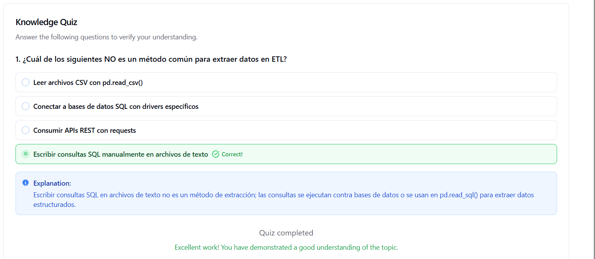

# **Ejercicio**: Extracción desde múltiples fuentes heterogéneas
Ejercicio práctico para aplicar los conceptos aprendidos.
| Autor            | Fecha        | Día |
|------------------|--------------|----------|
| **Carlos Vásquez** |24 Noviembre 2025 | 2|
## 1 Crear un entorno virtual windows

```sh
python -m venv venv
```
## 1.1 Activar el entorno virtual
```sh
venv\Scripts\activate
```

## 1.2 Instalar Dependencias en el entorno virtual
```sh
pip install pandas openpyxl requests
```

## 1.3 Guardar las dependencias
```sh
pip freeze > requeriments.txt
```
## 1.4 Opcional En en plano que se tenga directo donde se tenga las dependencias 
```nginx 
pandas
openpyxl
requests
```
## 1.5 Se instala directo las dependecias
```sh
pip install -r requirements.txt
```
README.md ← (este archivo)

requirements.txt ← dependencias

generate_data.py ← crea los archivos de ejemplo

extract_data.py ← ejecuta la extracción y validaciones

ventas.csv ← (generado por generate_data.py)

datos.xlsx ← (generado)

productos.json ← (generado)

ventas.db ← (generado: SQLite)

salida.txt  ← (generado por extract_data.py)

## 3 Crear datos de ejemplo en diferentes formatos:
### generate_data.py

(Crea: ventas.csv, datos.xlsx, productos.json, ventas.db)

```python
import pandas as pd
import sqlite3
import json

# --- CSV ---
ventas_csv = pd.DataFrame({
    'id_venta': range(1, 6),
    'producto': ['Laptop', 'Mouse', 'Teclado', 'Monitor', 'Audífonos'],
    'precio': [1200, 25, 80, 300, 150]
})
ventas_csv.to_csv('ventas.csv', index=False)

# --- Excel (múltiples hojas) ---
clientes_df = pd.DataFrame({
    'id_cliente': [1, 2, 3],
    'nombre': ['Ana', 'Carlos', 'María'],
    'ciudad': ['Madrid', 'Barcelona', 'Valencia']
})

with pd.ExcelWriter('datos.xlsx') as writer:
    ventas_csv.to_excel(writer, sheet_name='Ventas', index=False)
    clientes_df.to_excel(writer, sheet_name='Clientes', index=False)

# --- JSON ---
productos_json = [
    {'id': 101, 'nombre': 'Laptop', 'categoria': 'Electrónica'},
    {'id': 102, 'nombre': 'Mouse', 'categoria': 'Accesorios'}
]
with open('productos.json', 'w', encoding='utf-8') as f:
    json.dump(productos_json, f, ensure_ascii=False, indent=2)

# --- SQLite ---
conn = sqlite3.connect('ventas.db')
pedidos_df = pd.DataFrame({
    'id_pedido': [1, 2, 3],
    'id_cliente': [1, 2, 1],
    'fecha': ['2024-01-15', '2024-01-16', '2024-01-17'],
    'total': [1225, 25, 380]
})
pedidos_df.to_sql('pedidos', conn, index=False, if_exists='replace')
conn.close()

print("Archivos generados: ventas.csv, datos.xlsx, productos.json, ventas.db")

```

## 4 Extraer desde cada fuente:
## extract_data.py

(Lee todas las fuentes, las imprime y valida que sean DataFrame)

```python
import pandas as pd
import sqlite3

# Desde CSV
df_csv = pd.read_csv('ventas.csv')
print("Desde CSV:")
print(df_csv.head())

# Desde Excel (hoja específica)
df_excel_ventas = pd.read_excel('datos.xlsx', sheet_name='Ventas')
df_excel_clientes = pd.read_excel('datos.xlsx', sheet_name='Clientes')
print("\nDesde Excel - Ventas:")
print(df_excel_ventas.head())

# Desde JSON
df_json = pd.read_json('productos.json')
print("\nDesde JSON:")
print(df_json)

# Desde SQLite
conn = sqlite3.connect('ventas.db')
df_sql = pd.read_sql('SELECT * FROM pedidos', conn)
conn.close()
print("\nDesde SQLite:")
print(df_sql)

print("\nTodas las extracciones completadas y validadas.")

# ===========================================
# EXPORTACIÓN A ARCHIVO UTF-8 (salida.txt)
# ===========================================
with open("salida.txt", "w", encoding="utf-8") as f:
    f.write("=== EXTRACCIÓN COMPLETA ===\n\n")

    f.write("--- CSV ---\n")
    f.write(df_csv.to_string())
    f.write("\n\n")

    f.write("--- Excel (Ventas) ---\n")
    f.write(df_excel_ventas.to_string())
    f.write("\n\n")

    f.write("--- Excel (Clientes) ---\n")
    f.write(df_excel_clientes.to_string())
    f.write("\n\n")

    f.write("--- JSON ---\n")
    f.write(df_json.to_string())
    f.write("\n\n")

    f.write("--- SQLite ---\n")
    f.write(df_sql.to_string())
    f.write("\n\n")

print("Archivo 'salida.txt' generado correctamente en UTF-8.")

```

## Generar Datos de Ejemplos
```sh
python generate_data.py
```

## Extraer datos desde cada fuente
```sh
python extract_data.py
```
## Los Datos de la salida estan guardados en

-  salida.txt

## Evidencia del quiz 

